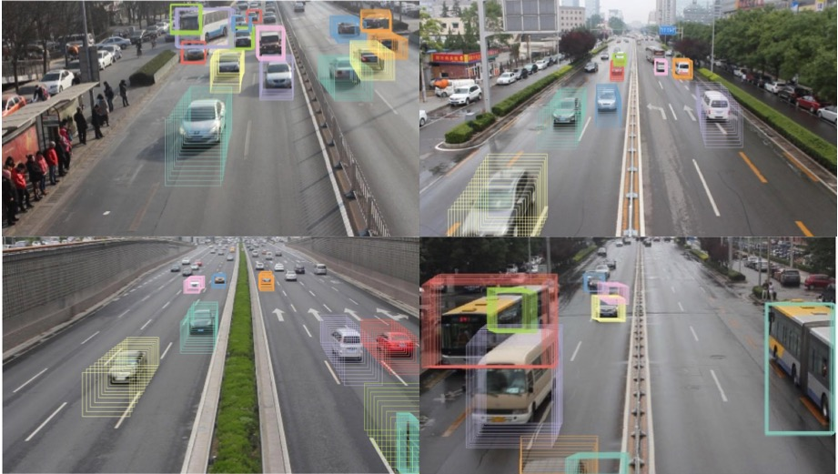

# Welcome to Chenge's Website

## About me

Hello World!  😎

I am _Lexi Chenge Li_, a fourth year PhD student studying **machine learning** and **computer vision** at the [Video Lab](http://vision.poly.edu/index.html/) at New York University. My supervisor is Prof. [Yao Wang](http://eeweb.poly.edu/~yao/).

## Research Projects

### TrackNet: Joint Object Detection and Tracking (submitted to ICCV 2017)

Object detection and object tracking are usually treated as two separate processes. Object detection in still images
relies on spatial appearance features, whereas object tracking in videos relies on both spatial appearance and temporal
motion features. Significant progress has been made for object detection in 2D images (or video frames) using deep
learning networks such as region CNN and subsequent variants. The usual pipeline for object tracking requires that
the object be successfully detected in the first frame or in every frame, and tracking is done by “associating” detection
results. However, performing object detection and object tracking through a single network remains a challenging
open question. 

We propose a novel network structure that can directly detect a 3D tube enclosing a moving object
in a video by extending the region-CNN framework for object detection in an image. The proposed trackNet works
over short video segments and outputs a bounding tube for each detected moving object, which includes shifted bounding boxes covering the detected object in successive frames. A Tube Proposal Network (TPN) inside the trackNet is proposed to predict the objectiveness of each candidate tube and location parameters specifying the bounding tube with a high objectiveness score. 

### Model Architecture

### Detection results

### Joint Detection & Tracking by Bounding Tubes

----------------

### Robust Vehicle Tracking at Urban Intersections
[Vehicle Tracking site](http://chengeli.github.io/VehicleTracking/)

----------------

### A Comparison of Machine Learning and Feature Selection Methods for Predicting Breast Cancer Related Lymphedema [Master's Thesis]  

----------------

### Semantic Grouping
[ Semantic Grouping site](http://chengeli.github.io/semantic_grouping/)

----------------

### Human Upper Body Segmentation
[Poster](https://github.com/ChengeLi/semantic_grouping/blob/master/Human%20Upper%20Body%20Segmenta2on.pdf)

----------------

##Prize  🏆

**Grand Prize** for the _MLBAM Automatic Video Annotation Challenge_ held by [NYC Media Lab](http://nycmedialab.org/)
May 11, 2015 

Last Update: Mar 20, 2017 

