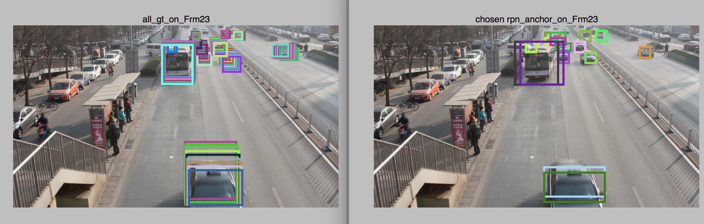

# Welcome to Chenge's Website

## About me

Hello World!  😎

I am _Lexi Chenge Li_, a fourth year PhD student studying **machine learning** and **computer vision** at the [Video Lab](http://vision.poly.edu/index.html/) at New York University. My supervisor is Prof. [Yao Wang](http://eeweb.poly.edu/~yao/).

## Research Projects

#### Towards Solving Detection and Tracking Simutaneously

Object detection in 2D still images are already pretty successfully. With works such as faster rCNN, YOLO, SSD etc, we can already do real-	time object detection across multiple classes. What about videos? Can we do object detection in videos as accurate as in images now? What about tracking them? Is there a way to detect and track mutiple objects simutaneously? Is there a way to solve this more elegantly?

We will treat detection and tracking as one whole problem and try to tackle them at the same time.

----------------
#### Robust Vehicle Tracking at Urban Intersections
[Vehicle Tracking site](http://chengeli.github.io/VehicleTracking/)

----------------

#### A Comparison of Machine Learning and Feature Selection Methods for Predicting Breast Cancer Related Lymphedema [Master's Thesis]  

----------------

#### Semantic Grouping
[ Semantic Grouping site](http://chengeli.github.io/semantic_grouping/)

----------------

#### Human Upper Body Segmentation
[Poster](https://github.com/ChengeLi/semantic_grouping/blob/master/Human%20Upper%20Body%20Segmenta2on.pdf)

----------------

##Prize🏆
**Grand Prize** for the **MLBAM Automatic Video Annotation Challenge**  
May 11, 2015

