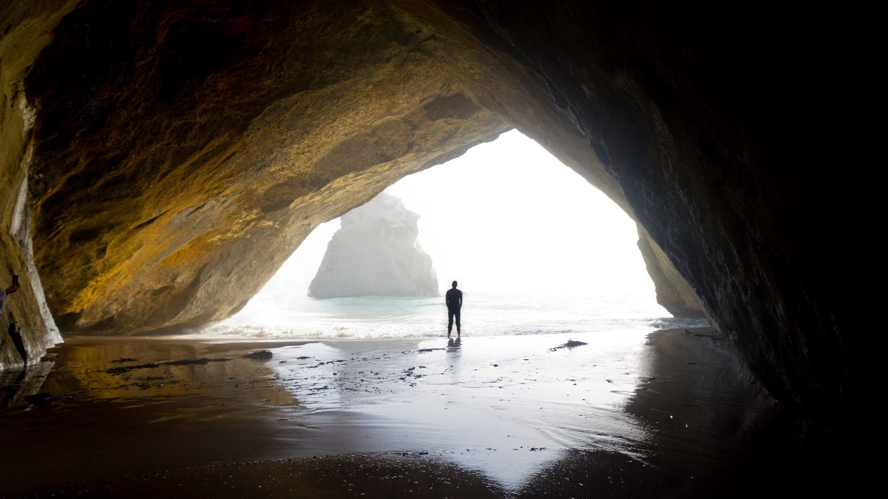

# Welcome to Chenge's Website

## About me

Hello World!  😎

I am _Lexi Chenge Li_, a fifth year PhD student studying **machine learning** and **computer vision** at the [Video Lab](http://vision.poly.edu/index.html/) at New York University. My supervisor is Prof. [Yao Wang](http://eeweb.poly.edu/~yao/). 

## Research Projects

### TrackNet: Simultaneous Detection and Tracking of Multiple Objects (submitted to CVPR 2018)

Object detection and object tracking are usually treated as two separate processes. Object detection in still images
relies on spatial appearance features, whereas object tracking in videos relies on both spatial appearance and temporal
motion features. Significant progress has been made for object detection in 2D images (or video frames) using deep
learning networks such as region CNN and subsequent variants. The usual pipeline for object tracking requires that
the object be successfully detected in the first frame or in every frame, and tracking is done by “associating” detection
results. However, performing object detection and object tracking through a single network remains a challenging
open question. 

We propose a novel network structure that can directly detect a 3D tube enclosing a moving object
in a video by extending the region-CNN framework for object detection in an image. The proposed trackNet works
over short video segments and outputs a bounding tube for each detected moving object, which includes shifted bounding boxes covering the detected object in successive frames. A Tube Proposal Network (TPN) inside the trackNet is proposed to predict the objectiveness of each candidate tube and location parameters specifying the bounding tube with a high objectiveness score. 

### Model Architecture

### Joint Detection & Tracking by Bounding Tubes

----------------

### Robust Vehicle Tracking at Urban Intersections
[Vehicle Tracking site](http://chengeli.github.io/VehicleTracking/)

----------------

### A Comparison of Machine Learning and Feature Selection Methods for Predicting Breast Cancer Related Lymphedema [Master's Thesis]  

----------------

### Semantic Grouping
[ Semantic Grouping site](http://chengeli.github.io/semantic_grouping/)

----------------

### Human Upper Body Segmentation
[Poster](https://github.com/ChengeLi/semantic_grouping/blob/master/Human%20Upper%20Body%20Segmenta2on.pdf)

----------------

##Internship
**Apple** Inc. Cupertino, CA

Jun 2017 – Aug 2017 summer internship
Computer vision research intern. 
Single image super resolution using convolutional neural networks.

##Publications
* Chenge Li, Gregory Dobler, Yilin Song, Xin Feng, and Yao Wang. “TrackNet: Simultaneous Detection and Tracking of Multiple Objects” (under review) 
* Yilin Song, Chenge Li, and Yao Wang. “Pixel-wise object tracking” (under review)
* Chenge Li, A. Chiang, Gregory Dobler, Y. Wang, Kun Xie, Kaan Ozbay, Masoud Ghandehari, J. Zhou, and D. Wang. "Robust vehicle tracking for urban traffic videos at intersections." In Advanced Video and Signal Based Surveillance (AVSS), 2016 13th IEEE International Conference on, pp. 207-213. IEEE, 2016.
* Kun Xie, Chenge Li, Kaan Ozbay, Gregory Dobler, Hong Yang, An-Ti Chiang, and Masoud Ghandehari. "Development of a comprehensive framework for video-based safety assessment." In Intelligent Transportation Systems (ITSC), 2016 IEEE 19th International Conference on, pp. 2638-2643. IEEE, 2016.
* Yilin Song, Yuanyi Xue, Chenge Li, Xuan Zhao, Sixuan Liu, Xiaona Zhuo, Kangjin Zhang et al. "Online Cost Efficient Customer Recognition System for Retail Analytics." In Applications of Computer Vision Workshops (WACVW), 2017 IEEE Winter, pp. 9-16. IEEE, 2017.
* Yuanyi Xue, Yilin Song, Chenge Li, An-Ti Chiang, and Xiaoran Ning. "Automatic Video Annotation System for Archival Sports Video." In Applications of Computer Vision Workshops (WACVW), 2017 IEEE Winter, pp. 23-28. IEEE, 2017.

##Prize  🏆

**Grand Prize** for the _MLBAM Automatic Video Annotation Challenge_ held by [NYC Media Lab](http://nycmedialab.org/)
May 11, 2015 

Last Update: Feb 15, 2018 

